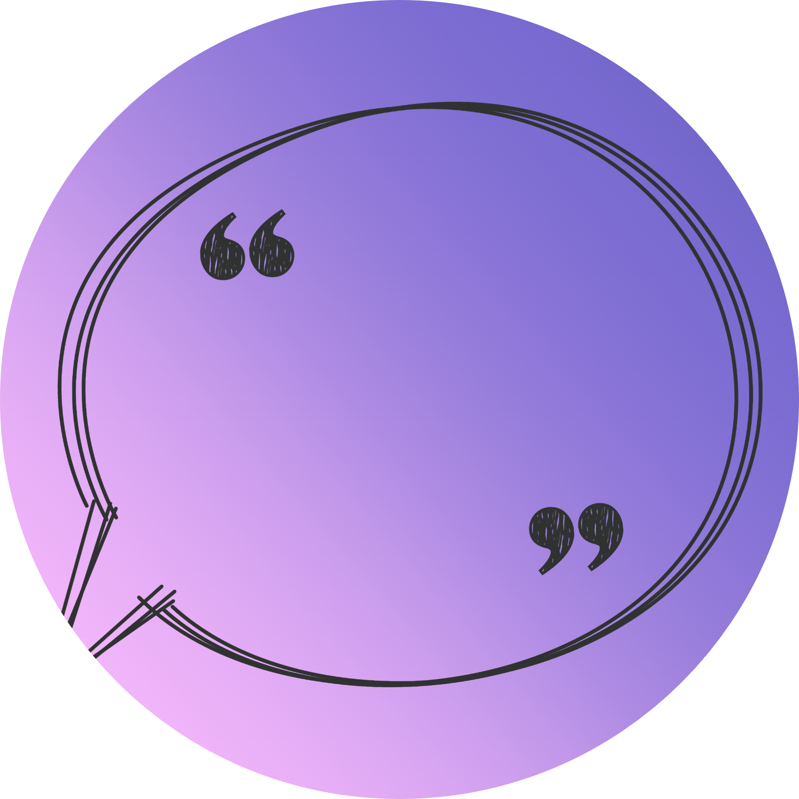

# Quote Bot


[](https://github.com/katsofroniou/quote-bot/blob/main/LICENSE)
[](https://github.com/katsofroniou/quote-bot/issues)
[](https://github.com/katsofroniou/quote-bot/graphs/commit-activity)

## Bot Commands
| Slash Command   | Inputs          | Usage                                                           |
|-----------------|-----------------|-----------------------------------------------------------------|
| `/quote`        | content, author | Saves a quote manually using user input                         |
| `/quotelink`    | message link    | Saves a quote using a link provided                             |
| `/deleteone`    | id              | Deletes a single quote                                          |
| `/deleteall`    |                 | Deletes all server quotes                                       |                         
| `/searchauthor` | author          | Searches for and returns all quotes said by a specific author   |
| `/searchid`     | id              | Searches for and returns a quote with specified id              |
| `/searchphrase` | phrase          | Searches for and returns a set of quotes with a specific phrase |
| `/listall`      |                 | Lists all of the server quotes                                  |
| `/exportcsv`    |                 | Exports all server quotes as a csv file                         |

There is also a context menu command. Right click the message you want to quote, go to apps, and press 'quote this'

---

## Tech Stack

- **Discord.js v14.12.1:** Facilitates the bot's interaction with the Discord API.
- **Node.js v20.4.0:** Provides the backend runtime environment for the bot.
- **MongoDB v5.7.0:** Utilized for quote storage and retrieval.

---

## Contributors
- [Katerina Sofroniou](https://github.com/katsofroniou)
- [Leo Durrant](https://github.com/zanyleonic)

## How to Contribute

## Disclaimer

This tutorial is specifically for contributing to the Quote Bot project and not for self-deployment of the bot. 
Hosting the bot yourself is not supported.

While I'm the sole maintainer of this Quote Bot, if you want to suggest any changes or improvements, here's how: 

### Step 1: Fork the Repository

1. Visit the [Quote Bot repository](https://github.com/katsofroniou/quote-bot).
2. Click the "Fork" button in the top right corner of the repository page.
3. This will create a copy of the repository under your GitHub account.

### Step 2: Clone Your Fork

1. Go to your forked repository on GitHub.
2. Click the "Code" button and copy the repository URL.
3. Open your terminal or command prompt.
4. Navigate to the directory where you want to clone the repository.
5. Run the following command to clone your fork: `git clone <repository-url>`

### Step 3: Make Changes

1. Create a new branch for your changes: `git checkout -b <your-feature-branch>`
2. Make necessary changes to the code.
3. Commit your changes: `git commit -m "Your commit message"`

### Step 4: Push Changes to Your Fork

1. Push your changes to your fork: `git push origin your-feature-branch`
### Step 5: Create a Pull Request

1. Visit your forked repository on GitHub.
2. You should see a banner indicating your recent push. Click on "Compare & pull request".
3. Fill in the details of your pull request, describing the changes you made.
4. Click "Create pull request".

I'll review your pull request and provide feedback if necessary.

---

## License Summary

This project is licensed under the Apache License 2.0. For the full terms and conditions, please refer to the [LICENSE](LICENSE) file.

---

```
    Copyright (C) 2023 Katerina Sofroniou
  
    Licensed under the Apache License, Version 2.0 (the "License"); 
    you may not use this file except in compliance with the License. 
    You may obtain a copy of the License at 
  
        http://www.apache.org/licenses/LICENSE-2.0 
  
    Unless required by applicable law or agreed to in writing, software 
    distributed under the License is distributed on an "AS IS" BASIS, 
    WITHOUT WARRANTIES OR CONDITIONS OF ANY KIND, either express or implied. 
    See the License for the specific language governing permissions and 
    limitations under the License.
```